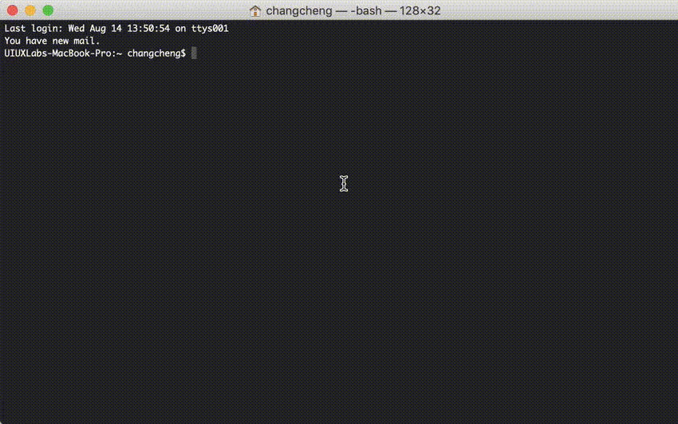

<p align="center">
  <a href="https://github.com/xizon/uix-kit">
	  
  </a>
  <p align="center">Make over <strong>120+</strong> components to wear again and again!</p>
  <p align="center">
      <a href="https://app.travis-ci.com/github/xizon/uix-kit" title="Travis CI"></a>
      <a href="https://validator.w3.org/nu/?doc=https%3A%2F%2Fxizon.github.io%2Fuix-kit%2Fexamples%2F" title="w3c"></a>
	  <a href="https://www.npmjs.com/package/uix-kit" title="npm version"></a>
	  <a href="https://github.com/xizon/uix-kit/blob/master/LICENSE" title="license"></a>
	   
  </p>
  <br>
</p>

**Uix Kit is not a framework, just a UI toolkit based on some common libraries for building beautiful responsive website.**

Uix Kit isn't a reusable component structure, mostly custom CSS and JavaScript based. Definitely interesting, and if you're developing mostly web content and not applications this is particularly useful. It is a web dev build tool/scaffold that does not depend on any framework.  You can import any external libraries/frameworks or native ES Modules for production. 

The generated core file in the dist directory can be used separately in any website. Support JS, HTML, and SASS component library automatically packaged. It is used to develop the full-static website (HTML templates or for dynamic language integration). 

> *The demo depends on jQuery (you can completely rewrite the script if needed). And `dist` DOES NOT bundle any third-party script and style library, all libraries are loaded externally in the HTML file.*

**Uix Kit is now in Long Term Support (LTS) mode.**

---

- [React Version - Native scaffolding for reference](https://github.com/xizon/poemkit)


---

- [English Documentation](README.md)
- [中文版说明文档](README_CN.md)

---


## Demo

[https://xizon.github.io/uix-kit/examples/](https://xizon.github.io/uix-kit/examples/)

GitHub pages can only serve static content, and there is no way to run PHP or get AJAX request on the pages. You need to visit the link below to see some special demos &#128071;

[https://uiux.cc/uix-kit](https://uiux.cc/uix-kit) 


## Table of Contents

* [Getting Started with Videos](#getting-started-with-videos)
* [Why use it](#why-use-it)
* [File Structures](#file-structures)
* [Getting Started](#getting-started)
* [HTML Template](#html-template)
* [How to Create a Custom Module？ &#128293; ](#how-to-create-a-custom-module)
* [Contributing](#contributing)
* [Changelog](#changelog)
* [Browser Support](#browser-support)
* [Supported development environment](#supported-development-environment)
* [Licensing](#licensing)


## Getting Started with Videos

[https://www.youtube.com/watch?v=aRDY9Cr-1-E](https://www.youtube.com/watch?v=aRDY9Cr-1-E)


## File Structures


```sh

uix-kit/
├── README.md   --------------------------- # Main Documentation
├── CHANGELOG.md   ------------------------ # Changelog
├── CONTRIBUTING.md   --------------------- # External resource references
├── LICENSE     --------------------------- # License
├── webpack.config.js  -------------------- # Webpack scaffold configuration file
├── server.js  ---------------------------- # Local server configuration
├── package.json  ------------------------- # Project configuration file (site info can be modified here)
├── package-lock.json
├── dist/
│   ├── css/
│   │   ├── uix-kit.css  ------------------ # Main css file
│   │   ├── uix-kit.css.map
│   │   ├── uix-kit.min.css  -------------- # Main css file which is used for production
│   │   ├── uix-kit.min.css.map
│   │   ├── uix-kit-rtl.css   ------------- # Main RTL css file
│   │   ├── uix-kit-rtl.css.map
│   │   ├── uix-kit-rtl.min.css   --------- # Main RTL css file which is used for production
│   │   └── uix-kit-rtl.min.css.map
│   └── js/
│   │   ├── uix-kit.js   ------------------ # Main js file
│   │   ├── uix-kit.js.map
│   │   ├── uix-kit.min.js  --------------- # Main js file which is used for production
│   │   ├── uix-kit.min.js.map
│   │   ├── uix-kit-rtl.js
│   │   ├── uix-kit-rtl.js.map
│   │   ├── uix-kit-rtl.min.js
│   │   └── uix-kit-rtl.min.js.map
├── misc/                
│   ├── screenshots/  --------------------- # Screenshots
│   └── grid/ ----------------------------- # PSD grid system
├── src/
│   ├── components/
│   │   ├── _app-load.ts  ------------- # Import your modules to be used
│   │   ├── _app-load-rtl.ts  --------- # Import your RTL modules to be used
│   │   ├── _global/ ------------------ # Generic modules
│   │   ├── _main/  ------------------- # Customization site file directory (for secondary or new website development)
│   │   ├── _third-party-plugins/  ---- # Third-party plugins
│   │   └── */  ----------------------- # Core functional modules
├── examples/                                
│   ├── *.html  --------------------------- # HTML templates
│   └── assets/  -------------------------- # Static resource directory
│   │       ├── css/
│   │       ├── fonts/
│   │       ├── images/
│   │       ├── videos/
│   │       ├── models/
│   │       ├── json/
│   │       └── js/
└──
```


## Why use it

* `dist` DOES NOT bundle any third-party script and style library, all libraries are loaded externally in the HTML file.
* Not a reusable component structure
* Not a JavaScript framework
* It is used to build the full-static website (HTML templates or for dynamic language integration)
* Suitable for developing Visual Interaction websites and WordPress templates
* W3C standard and SEO 
* Control scope with BEM naming, so the core Uix Kit project is not in conflict with the other projects
* Automatically generate a table of contents for each module comment of the name
* Each module consists of SASS / SCSS, JavaScript and HTML files
* Embedded verification strategy for **TypeScript** and **React**. (Such scripts are embedded in the page, not the entire project)
* Compatible with Bootstrap 5.x (You could also remove Bootstrap's stylesheets)
* Provides a common web page components and layouts
* The complete directory of examples in order to develop a responsive website independently without Node.js dev environment
* The demo depends on jQuery (you can completely rewrite the script if needed)


* * *


## Getting Started




You will need to have [node](https://nodejs.org/) setup on your machine. That will output the built distributables to `./dist/*` and `./examples/*.html`.


**Step 1.** Use NPM (Locate your current directory of project, and enter the following command.) or download the latest version from [Github](https://github.com/xizon/uix-kit). For nodejs you have to install some dependencies.

```sh
$ sudo npm install uix-kit
```

Or clone the repo to get all source files including build scripts: 

```sh
$ git clone git://github.com/xizon/uix-kit.git
```


**Step 2.** First, using an absolute path into your `"uix-kit/"` folder directory.

```sh
$ cd /{your_directory}/uix-kit
```


**Step 3.** Before doing all dev stuff make sure you have `Node 10+` installed. After that, run the following code in the main directory to install the node module dependencies.

```sh
$ npm install
```

<blockquote>
The current test environment is `Node 18+`, `npm 9+`. If dependency installation fails ( Usually it is because you have upgraded your Nodejs version, currently tested to Node 18+ ), maybe the new version of npm will conflict with the old version of npm, please use following command to install dependencies:

```sh
$ npm install --legacy-peer-deps
```

If the installation still fails, please use this method: remove **devDependencies** in `package.json`, delete file `package-lock.json`  and reinstall dependencies:

```sh
$ npm install --save-dev @babel/core @babel/plugin-proposal-class-properties @babel/plugin-transform-runtime @babel/polyfill @babel/preset-env @babel/preset-flow @babel/preset-react @babel/preset-typescript babel-loader babel-plugin-module-resolver clean-webpack-plugin cross-env css-loader css-minimizer-webpack-plugin express file-loader glslify-loader html-loader include-file-webpack-plugin json-loader log-timestamp mini-css-extract-plugin moment sass postcss prettier prettier-loader random-string raw-loader react react-dom sass-loader style-loader tar terser-webpack-plugin webpack webpack-cli webpack-concat-files-plugin webpack-dev-middleware webpack-dev-server
```
</blockquote>


**Step 4.** When you’re ready to deploy to production, create a minified bundle with:

```sh
$ npm run build
```
Using `Ctrl + C` to stop it.

When you have done, this will spin up a server that can be accessed at `http://localhost:8080/examples/`


**Step 5.** To preview the page without compiling and packaging, please run the following command:

```sh
$ npm run preview
```

All pages can be previewed via `http://localhost:3000`. 

<blockquote>
But there is no way to run PHP or get AJAX request on the pages. You need to visit the link on your server, or build a server via MAMP. Then visit a similar URL: <strong>http://localhost:{port}/uix-kit/examples/</strong>
</blockquote>


### Note:
 

**a) How to use modules?**

You could custom modules of what to import in `src/components/_app-load.ts` and `src/components/_app-load-rtl.ts`. Because the modules are imported too much, you need to wait at least 5.5 seconds (default value). You can set the compilation wait time in the `webpack.config.js` according to the imported modules you want.


**b) Site Info Configuration**

You can update the Placeholders in Templates by modifying the Site Info configuration of `package.json`. Like this:

```json
{
  "author": "UIUX Lab",
  "name": "uix-kit",
  "email": "uiuxlab@gmail.com",
  "version": "1.0.0",
  "projectName": "Uix Kit",
  "createdInfo": "UIUX Lab (https://uiux.cc)",
  "projectURL": "https://uiux.cc",
  "description": "A free web kits for fast web design and development, compatible with Bootstrap v5.",
  ...
}
```


**c) ERROR: npm update check failed.**

Solution:

```sh
$ sudo chown -R $USER:$(id -gn $USER) /Users/{username}/.config
```

**d) ERROR: Node sass version 6.x.x is not compatible with ^ 4.x.x.**

Solution:

```sh
$ npm install node-sass@4.14.1
```


**e) If you upgrade the version of Node, please execute the following code:**

```sh
$ sudo npm install
$ sudo npm rebuild node-sass
```


* * *


## HTML Template

### 1\. Static HTML code

```html
<!DOCTYPE html>
<html dir="ltr" lang="en-US">
<head>
	<meta charset="utf-8" />
	<title>Web Site Title</title>
	
	<!-- Compatibility Settings
	============================================= -->
	<meta name="viewport" content="width=device-width, initial-scale=1, maximum-scale=1" />
    <meta http-equiv="X-UA-Compatible" content="IE=edge">
	<!-- Compatibility Settings end -->

	<!-- Core & Theme CSS
	============================================= -->

	<!-- Basic  -->
	<link rel="stylesheet" href="assets/css/bootstrap.min.css?ver=5.0.2" media="all"/>
	<link rel="stylesheet" href="assets/css/video.min.css?ver=7.4.1" media="all"/>


	<!-- Icons  -->
	<link rel="stylesheet" href="assets/fonts/fontawesome/css/all.min.css?ver=5.7.0">
	<link rel="stylesheet" href="assets/fonts/fontawesome/css/v4-shims.min.css?ver=5.7.0">


	<!-- Theme  -->
	<link rel="stylesheet" href="../dist/css/uix-kit.min.css?ver=1.0.0"/>


    <!-- Overwrite Font Files 
        *
        * The fonts extracted with `mini-css-extract-plugin` may not load correctly
        * Font files in `dist/fonts/` are fetched automatically by `file-loader`, you can configure webpack.config.js to name them.
    ============================================= --> 
    <!--
    <style>
    @font-face {
        font-family: '...';
        font-style: normal;
        font-weight: 900;
        font-display: $fa-font-display;
        src: url('../dist/fonts/....eot');
        src: url('../dist/fonts/....eot?#iefix') format('embedded-opentype'),
        url('../dist/fonts/....woff2') format('woff2'),
        url('../dist/fonts/....woff') format('woff'),
        url('../dist/fonts/....ttf') format('truetype'),
        url('../dist/fonts/....svg#fontawesome') format('svg');
    }
    </style>
    -->
    <!-- Overwrite Font Files   end -->


	<!--[if lt IE 10]>
	<link rel="stylesheet" href="assets/css/IE.css?ver=1.0.0" />
	<![endif]-->


	<!-- Core & Theme CSS  end -->
	<!-- Vendor
	============================================= -->
	<script src="assets/js/min/jquery.min.js?ver=3.6.1"></script>
    <script src="assets/js/min/modernizr.min.js?ver=3.5.0"></script>
	<!-- Vendor  end -->

	<!-- Break free from CSS prefix hell!
	============================================= -->
	<script src="assets/js/min/prefixfree.min.js?ver=1.0.7"></script>

</head> 

<body> 
	
	{your_html_codes_here}
	
	
	<!-- Vendor -->
    <script src="assets/js/min/axios.min.js?ver=0.19.2"></script>
	<script src="assets/js/min/jquery.waitforimages.min.js?ver=1.0"></script>
	<script src="assets/js/min/video.min.js?ver=7.4.1"></script>
	<script src="assets/js/min/TweenMax.min.js?ver=2.0.2"></script>
	<script src="assets/js/min/pixi.min.js?ver=4.8.4"></script>
	<script src="assets/js/min/three.min.js?ver=r99"></script>
	<script src="assets/js/min/anime.min.js?ver=2.2.0"></script>
	<script src="assets/js/min/hammer.min.js?ver=2.0.8"></script>

	<!-- Your Plugins & Theme Scripts
	============================================= -->
	<script>
        /*
        * Some global vars. DO NOT change these variables names. 
        * These variables are being used in `uix-kit.min.js`.
        *    
        */ 
		var REVISION     = "1.0.0",
			APP_ROOTPATH = {
				"templateUrl" : "", //If the file is in the root directory, you can leave it empty. If in another directory, you can write: "/blog"
				"homeUrl"     : "",  //Eg. https://uiux.cc
				"ajaxUrl"     : ""   //Eg. https://uiux.cc/wp-admin/admin-ajax.php
			};
        

        /*
        * Fixed a bug that Cannot read property 'fn' of undefined for jQuery 1.xx.x.
        *    
        */
        window.$ = window.jQuery;
	</script>
	<script src="../dist/js/uix-kit.min.js?ver=1.0.0"></script>
	
</body>

</html>

```

### 2\. PSD Grid Templates

You can download the corresponding .PSD grid files.

*   `misc/grid/bootstrap3_1170_grid_web.psd` (Default Container: 1170px)
*   `misc/grid/bootstrap3_1278_grid_web.psd` (XL Container: 1278px)
*   `misc/grid/bootstrap3_1410_grid_web.psd` (XXL Container: 1410px)


## How to Create a Custom Module

Assuming you are in your application's root directory and want to create components inside `src/components/` as you show above. You can create a new directory and name it **demo-module**. 

&#128071;&#128071;&#128071;


Here’s a sample custom module directory structure, I’ve included some examples of files that would sit inside of each folder:


```sh

uix-kit/
├── src/
│   ├── components/
│   │     ├── _app-load.ts
│   │     ├── _app-load-rtl.ts
│   │     └── demo-module/
│   │              ├── scss/*.scss
│   │              ├── scss-rtl/*.scss
│   │              ├── js/*.(js|ts|tsx)
│   │              └── *.html
└──
```


**Step 1.** Inside that folder create two sub folders: `/scss` and `/js`. If you need to support RTL, create another `/scss-rtl`.


**Step 2.** Create a SASS/SCSS file. Go into the `src/components/demo-module/scss/` folder and create a file called: `_style.scss`. Please import global variables or functions. Here's an example:

```sh
/* ====================================================== 
   <!-- Demo Module Stylesheets --> 
/* ====================================================== */
@import '@uixkit/core/_global/scss/_variable-and-mixin.scss';

.app-demo {
	font-size: $basic-font-size;
    text-align: left;
}
```

**Step 2-2 (Optional).** Alright, so if you need to support RTL. You need create a new SASS/SCSS file. Go into the `src/components/demo-module/scss-rtl/` folder and create a file called: `_style.scss`. Like this:

```sh
/* ====================================================== 
   <!-- Demo Module Stylesheets --> 
/* ====================================================== */
@import '@uixkit/core/_global/scss/_variable-and-mixin.scss';

.app-demo {
    text-align: right;
}
```


**Step 3.** Create a JS file. Go into the `src/components/demo-module/js/` folder and create a file called: `index.js`. In order to make it work we need to import the global variables or functions in file index.js. 

Simultaneously, Now you’re ready to import your Stylesheets to use with this component. Import SASS/SCSS file in `src/components/demo-module/js/index.js`.

Like this:.

```sh
/* 
 *************************************
 * <!-- Demo Module Scripts  -->
 *************************************
 */
import {
    templateUrl,
    homeUrl,
    ajaxUrl,
    UixBrowser,
    UixModuleInstance,
    UixGUID,
    UixMath,
    UixCssProperty,
    UixDebounce,
    UixThrottle
} from '@uixkit/core/_global/js';

import '../scss/_style.scss';

export const DEMO_MODULE = ( ( module, $, window, document ) => {
	if ( window.DEMO_MODULE === null ) return false;

    module.DEMO_MODULE               = module.DEMO_MODULE || {};
    module.DEMO_MODULE.version       = '0.0.1';
    
    
    // executes when HTML-Document is loaded and DOM is ready
    module.DEMO_MODULE.documentReady = function( $ ) {
		/* 
		 ---------------------------
		 Function Name
		 ---------------------------
		 */ 
		// your code here...
	
    };
    module.components.documentReady.push( module.DEMO_MODULE.documentReady );
	
    
    
    // executes when complete page is fully loaded, including all frames, objects and images
    module.DEMO_MODULE.pageLoaded    = function() {
		/* 
		 ---------------------------
		 Function Name
		 ---------------------------
		 */ 
		 // your code here...
		
    };
    module.components.pageLoaded.push( module.DEMO_MODULE.pageLoaded );	


	return class DEMO_MODULE {
		constructor() {
			this.module = module;
		}
	};
})( UixModuleInstance, jQuery, window, document );

```


**Step 4.** So far, to dynamically import the module you just created in `src/components/_app-load.ts`.  The simplest version directly imports the default:


```sh
import DEMO_MODULE from '@uixkit/core/demo-module/js';
```


**Step 4-2  (Optional).** If you need to support RTL, in `src/components/_app-load-rtl.ts`.  like this:


```sh
import '@uixkit/core/demo-module/scss-rtl/_style.scss';
```

These RTL modules do not need JavaScript.


**Step 5 (Optional).** You could also create an HTML file to run the demo of this module separately, all HTML files will be automatically exported into the directory `examples/`. The demo code of the HTML file is as follows:


```sh
<!DOCTYPE html>
<html lang="@@{website_lang}" dir="@@{website_dirLTR}">
<head>
	<meta charset="@@{website_charset}" />
	<title>Demo Module - @@{website_title}</title>	
	@@include('./src/components/_global/include-header.html')
</head>  
<body class="page">
     
    @@include('./src/components/_global/include-loader.html')
    @@include('./src/components/_global/include-toggle-trigger.html')
 
    <div class="uix-wrapper">
        <!-- Header Area
        ============================================= -->      
        <header class="uix-header__container">
             <div class="uix-header">
                 <div class="container">
                        @@include('./src/components/_global/include-brand.html')
                        @@include('./src/components/_global/include-menu.html')
                  </div>
                  <!-- .container end -->
                  
                  <div class="uix-clearfix"></div>
             </div>
        
        </header>
        <div class="uix-header__placeholder js-uix-header__placeholder-autoheight"></div>
    
		<main id="uix-maincontent">
			<!-- Content   
			====================================================== -->
			<section class="uix-spacing--s uix-spacing--no-bottom">
				<div class="container">
					<div class="row">
						<div class="col-12">
							<h3>Demo Module</h3>
							<hr>
						</div>
					</div>
				</div>
			</section>
			
		   <!-- Content  
			====================================================== -->
			<section class="uix-spacing--s">
				<div class="container uix-t-c">
                    <div class="row">
                        <div class="col-12">
                            ...
                        </div>
                    </div>
				</div>
			</section>   
		</main> 
        
        @@include('./src/components/_global/include-copyright.html')
        
    </div>
    <!-- .uix-wrapper end -->
        
    @@include('./src/components/_global/include-footer.html')
```

**Note &#128161;:** You could call a specified module script which is commonly used for callbacks of AJAX request from Asynchronous method. The demo code is here:

```sh
import { UixModuleInstance } from '@uixkit/core/_global/js';

if ( UixModuleInstance.DEMO_MODULE ) UixModuleInstance.DEMO_MODULE.pageLoaded();
if ( UixModuleInstance.DEMO_MODULE ) UixModuleInstance.DEMO_MODULE.documentReady($);
```


**Since Uix Kit is not a JavaScript framework, you could use any third-party libraries to build your custom module styles and animation scripts in the most intuitive way.**


## Contributing

Finding bugs, sending pull requests or improving our docs - any contribution is welcome and highly appreciated. To get started, head over to our [contribution guidelines](CONTRIBUTING.md). Thanks!


## Changelog

[releases](CHANGELOG.md)


## Browser Support

| Chrome | Firefox | Edge | IE| Safari |Opera | iOS  | Android
| --- | --- | --- | --- | --- | --- | --- | --- |
| >= 49 | >= 45 | >=14 | >=11 | >= 9 | >= 30 | >=10 | >=4.4 |


## Supported development environment

- React 18 +
- TypeScript 4.x.x + 
- Babel 7.x.x + 
- Webpack 5.x.x
- Express 4.x.x

## Licensing

Licensed under the [MIT](https://opensource.org/licenses/MIT).


